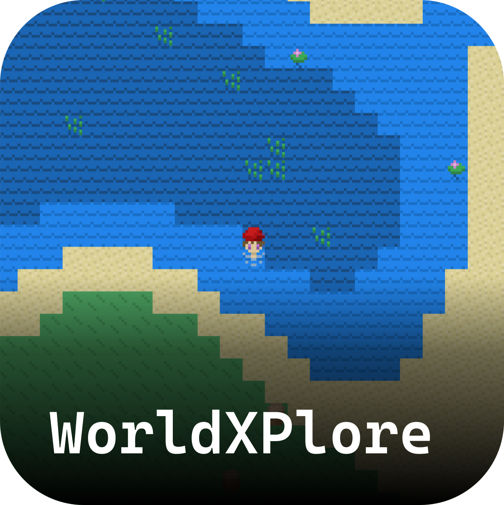
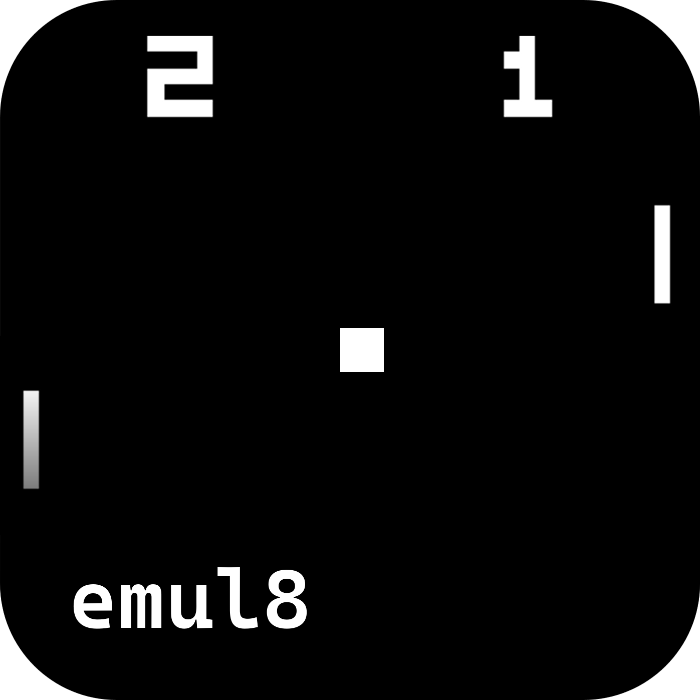
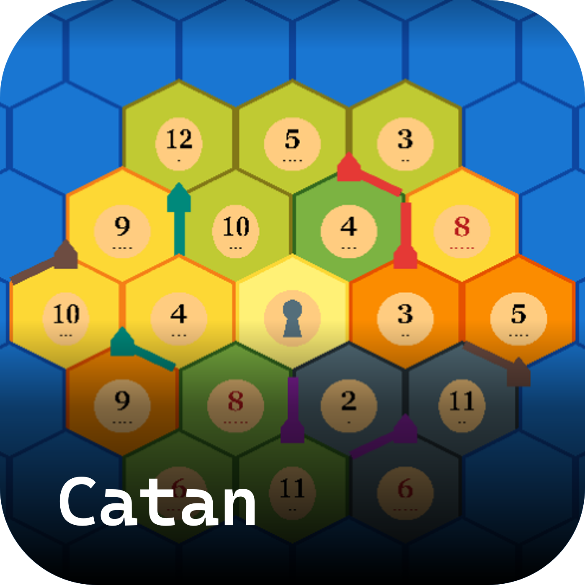
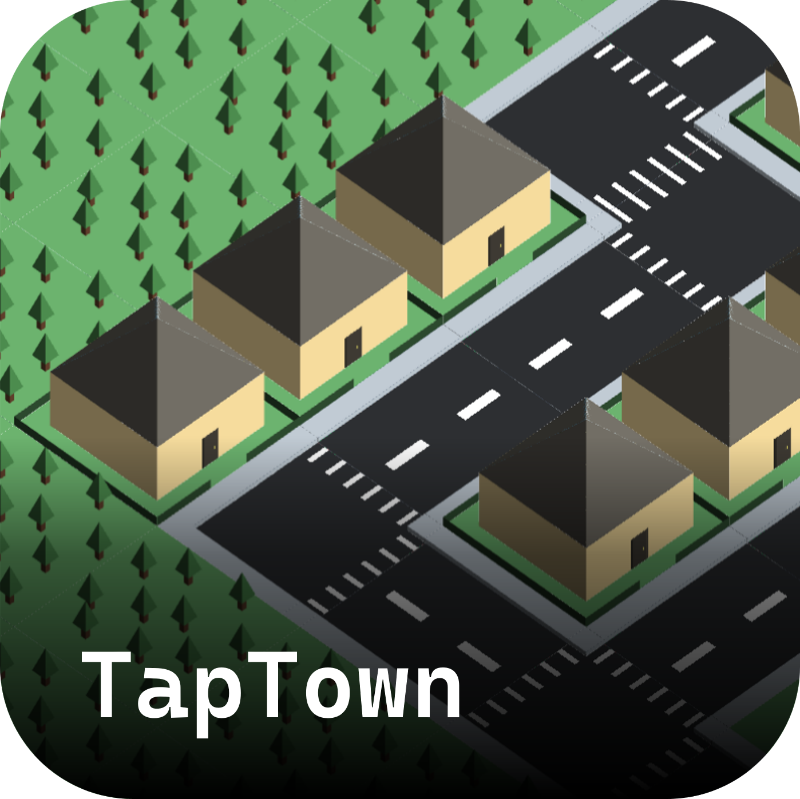

## 👋 Hi, I’m James!
- 🏫 I'm studying computer engineering at McGill.
- 👨🏼‍💻 I've built projects using js, ts, rust, c, swift, python, java, and dart.
- 👀 I’m currently interested in graphics programming, emulators, and embedded programming.

## Some Highlights
|  |  |  |  | 
:-------------------------:|:-------------------------:|:-------------------------:|:-------------------------:
